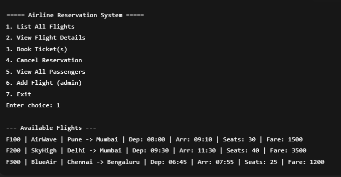
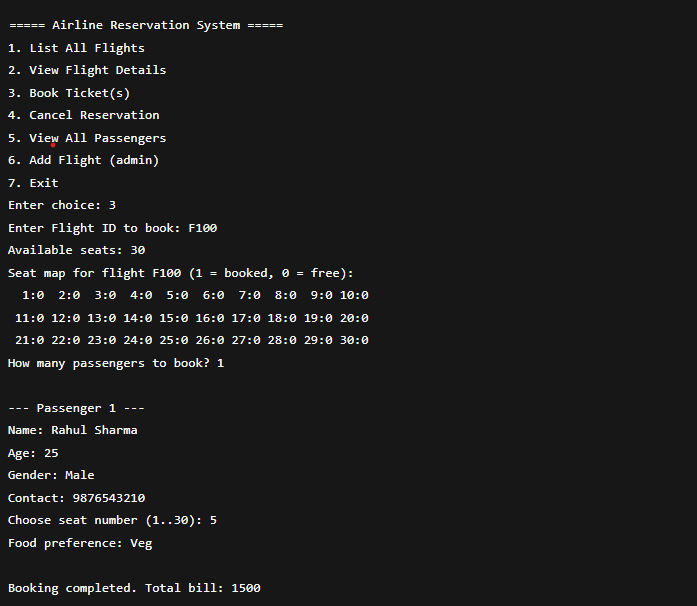
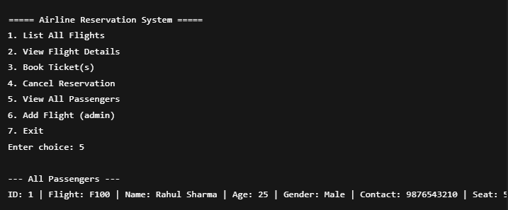

---

# ✈️ Airline Flight Reservation System

A **C++ console-based application** simulating a real-world airline reservation system.
Built using **Object-Oriented Programming (OOP)**, **Linked Lists**, and **File Handling**.

---

## 🚀 Features

* 🔍 **View Flights** – Display available flights, routes, timings, and fares.
* 🎟️ **Ticket Booking** – Book seats with passenger details (name, age, gender, contact, food preference).
* 🪑 **Seat Selection** – Choose seats dynamically with availability checks.
* 🍽️ **Meal Preferences** – Capture and store passenger food choice.
* ❌ **Ticket Cancellation** – Cancel bookings by Passenger ID.
* 📋 **Passenger Records** – View passenger details for each flight.
* 💾 **Persistent Storage** – All flight & passenger data saved using **file handling**.
* 💰 **Billing** – Calculate fare per passenger including seat and meal options.

---

## 🛠️ Tech Stack

* **Language:** C++
* **Concepts Used:**

  * Object-Oriented Programming (OOP)
  * Linked Lists (dynamic passenger management)
  * File Handling (persistent storage)
  * Modular Programming (clean class design)

---

## 📂 Project Structure

```
📦 Airline-Reservation-System
 ┣ 📜 main.cpp                     # Entry point (menu-driven system)
 ┣ 📜 Flight.h / Flight.cpp        # Flight class (routes, timings, seats, fare)
 ┣ 📜 Passenger.h / Passenger.cpp  # Passenger linked list management
 ┣ 📜 ReservationSystem.h / .cpp   # Core booking & cancellation logic
 ┣ 📜 flights.txt                  # Stores flight information
 ┣ 📜 passengers.txt               # Stores passenger bookings
 ┣ 📂 images                        # UI Screenshots
 ┃    ├── book-ticket.png
 ┃    ├── list-flights.png
 ┃    ├── menu.png
 ┃    └── view-passengers.png
 ┗ 📜 README.md                    # Project documentation
```

---

### 📸 Demo Screenshots

### 🏠 Main Menu



### 🎟️ Book Ticket



### 🔍 List Flights


### 📋 View Passengers



---

## ▶️ How to Run

1. Clone the repository:

```bash
git clone https://github.com/harsh8767/ReservationSystem.git
cd ReservationSystem
```

2. Compile and run:

```bash
g++ main.cpp Flight.cpp Passenger.cpp ReservationSystem.cpp -o airline
./airline
```

---

## 📈 Future Improvements

* Add **Admin Panel** to add/remove flights.
* Implement **Login System** (Admin & Passenger).
* Improve **seat visualization** in the console.
* Add **payment simulation**.

---


